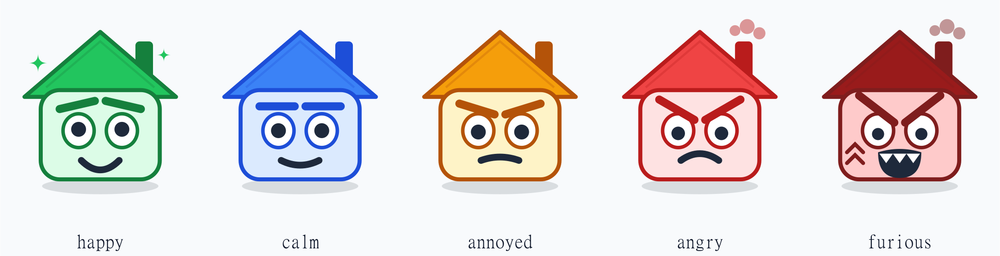

# ToDoHome

A shared household chore tracker for two people. A chore counts as done only
when **both** of them have ticked it off, so nothing gets quietly marked as
finished by one person alone.

It runs as a web app you can install on an iPhone home screen, and as an Android
app that adds a home screen widget with an increasingly angry mascot.

## What it does

**Two people, double confirmation.** Every chore has two checkboxes, one for
Riccardo and one for Roberta. Each person can only tick their own box. The chore
is closed, and its next due date starts counting, only once both boxes are
ticked.

**Chores come back on their own.** Each chore has a cadence: every day, every
two days, every three days, weekly, fortnightly or monthly. Once it is closed,
it reappears when the cadence has elapsed. Chores marked as weekend jobs, like
cleaning the bathroom or the kitchen, always land on a Saturday or Sunday.

**Or on a date you pick.** A chore can be tied to a calendar day instead of a
cadence, for the jobs that belong to a date rather than to a rhythm: swapping
the wardrobe on the 30th of May, the boiler service, a deadline. Say whether it
comes back on the same day every year or happens once and is gone. A date is
taken literally, so the weekend rule never moves it, and a yearly chore added
after its day has passed points at next year rather than showing up late.

**A clear picture of what is late.** The list is grouped into late, due today
and on track. Anything overdue shows how many days it has been sitting there.

**Put something off, honestly.** Swipe a chore to the right and its deadline
moves a day, without pretending it is done and without either tick going in.
Twice per cycle is the limit: after that the answer is no, so postponing cannot
quietly become a way of never doing anything.

**A run of clear days.** The header counts how long the house has gone with
nothing overdue, and remembers the best run so far. One late chore resets it.

**A done list you can walk back.** The second tab holds everything closed by
both of you, each showing when it was done and when it comes back. Both ticks
are there in green: remove yours and the chore returns to the to-do list right
away, still carrying the other person's confirmation. Underneath is a log of
recent completions, so you can see when something was really last done.

**Casimiro, the house mascot.** A little house with a face that reflects the
state of the home. He is calm when everything is under control, annoyed when one
chore slips, angry when several are late, and furious, steaming from the chimney
with a vein popping, when the place is falling apart.

**Editing the list.** The chores that ship with the app are only a starting
point. The plus button in the header creates a new one, and the pencil on any
card opens it for editing: name, icon, whether it repeats on a cadence or falls
on a chosen date, whether it is a weekend job, and a note. The same panel
deletes it, behind a second tap for confirmation.

**Android widget.** The mascot sits on the home screen with your own pending
chores underneath. Each row shows how late it is and whether the other person
has already confirmed it. Tapping the circle on the right ticks your box
without opening the app: the row turns green and says "Fatto ✓" for a moment,
then leaves the list, because from your side it is done. When you have ticked
everything the widget says whose turn it is now. Tapping the mascot forces a
refresh.

**A nudge in the morning.** Once a day the Android app checks what has fallen
behind and, if anything of yours is overdue, says so in a notification listing
the worst offenders. It only counts chores you have not ticked yet, so it goes
quiet as soon as you have done your part, and it never fires twice in one day.

**Your turn to confirm.** Because a chore needs both ticks, the second one used
to depend on somebody happening to look. Now, when the other person ticks
something you have not confirmed, Android says so.

**Live sync.** A tick on one phone shows up on the other one straight away.

**History.** Every closed chore is logged, so you can see when something was
actually last done.

## Getting started

1. Create a free Supabase project and run the two SQL files in `supabase/`.
2. Put the project URL and anon key in `web/.env.local`.
3. Run `npm install` and `npm run dev` in `web/`.
4. Build the Android app with `./gradlew assembleRelease` in `android/`.

The full step by step, including publishing to GitHub Pages and adding the app
to an iPhone home screen, is in [docs/SETUP.md](docs/SETUP.md).

## Project layout

| Folder      | What is in it                                            |
| ----------- | -------------------------------------------------------- |
| `web/`      | The app itself, a React PWA. This is the UI on both phones |
| `android/`  | Native shell plus the home screen widget                  |
| `supabase/` | Database schema and the starting chore list               |
| `docs/`     | Setup guide                                               |
